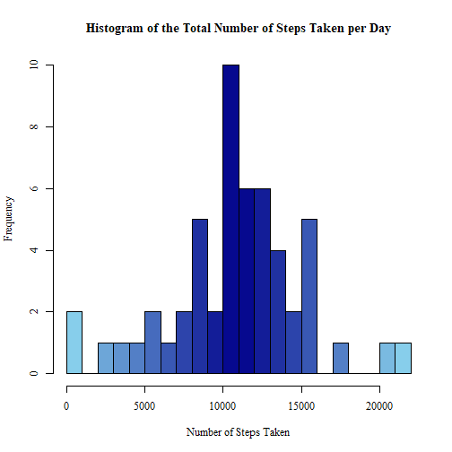
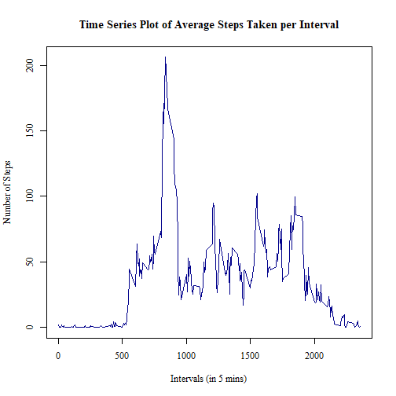
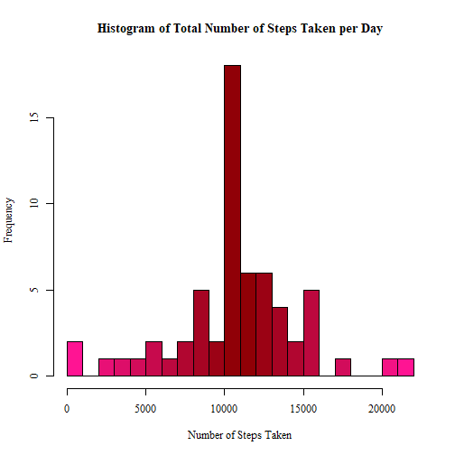
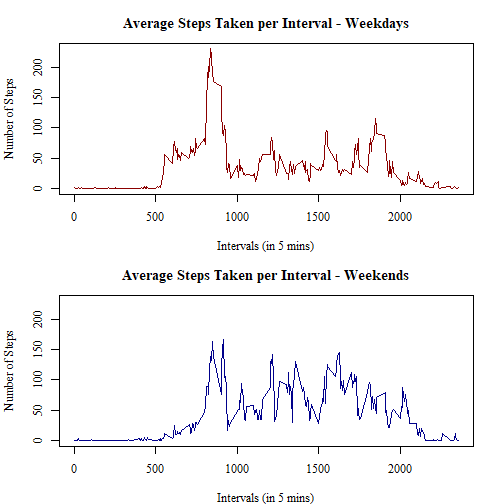

## Loading and preprocessing the data

```r
initialData <- read.csv("activity.csv", colClasses=c("numeric", "Date", "numeric"))
```

```
## Warning in file(file, "rt"): cannot open file 'activity.csv': No such file or directory
```

```
## Error in file(file, "rt"): cannot open the connection
```

```r
str(initialData)
```

```
## 'data.frame':	17568 obs. of  3 variables:
##  $ steps   : num  NA NA NA NA NA NA NA NA NA NA ...
##  $ date    : Date, format: "2012-10-01" "2012-10-01" ...
##  $ interval: num  0 5 10 15 20 25 30 35 40 45 ...
```

## What is mean total number of steps taken per day?


```r
data <- initialData[!(is.na(initialData$steps)), ]
totalStepsDay <- aggregate(steps ~ date, data, sum)
paletteBlue <- colorRampPalette(c("skyblue", "darkblue", "skyblue"))
hist(totalStepsDay$steps, breaks=20, xlab="Number of Steps Taken", 
     main="Histogram of the Total Number of Steps Taken per Day",
     col=paletteBlue(22), family="serif")
```




```r
library(dplyr)
totalStepsSummary <- summarise(totalStepsDay, meanOfTotalSteps=mean(totalStepsDay$steps))
print(totalStepsSummary)
```

```
##   meanOfTotalSteps
## 1         10766.19
```

## What is the average daily activity pattern?


```r
meanStepsInterval <- aggregate(steps ~ interval, data, mean)
plot(x=meanStepsInterval$interval, y=meanStepsInterval$steps, type="l",
     main="Time Series Plot of Average Steps Taken per Interval",
     ylab="Number of Steps", xlab="Intervals (in 5 mins)",
     col="darkblue", lwd=1.5, family="serif")
```




```r
meanStepsInterval[grep(max(meanStepsInterval$steps), meanStepsInterval$steps), ]
```

```
##     interval    steps
## 104      835 206.1698
```

## Imputing missing values


```r
completeData <- initialData
for(x in 1:17568) {
    if(is.na(completeData[x, 1])==TRUE) {
        completeData[x, 1] <- meanStepsInterval[meanStepsInterval$interval %in% completeData[x, 3], 2]
    }
}
completeTotalStepsDay <- aggregate(steps ~ date, completeData, sum)
paletteRed <- colorRampPalette(c("deeppink", "darkred", "deeppink"))
hist(completeTotalStepsDay$steps, breaks=20, xlab="Number of Steps Taken", 
     main="Histogram of Total Number of Steps Taken per Day",
     col=paletteRed(22), family="serif")
```




```r
StepsSummary <- summarise(completeTotalStepsDay, 
                                 meanOfTotalSteps=mean(completeTotalStepsDay$steps), 
                                 medianOfTotalSteps=median(completeTotalStepsDay$steps))  
print(StepsSummary)
```

```
##   meanOfTotalSteps medianOfTotalSteps
## 1         10766.19           10766.19
```

## Are there differences in activity patterns between weekdays and weekends?


```r
daysData <- completeData
daysData$days <- weekdays(daysData$date)
daysData$weekday <- as.character(rep(0, times=17568))
for(x in 1:17568) {
    if(daysData[x, 4] %in% c("sábado", "domingo")) {
        daysData[x, 5] <- "weekend"
    } else {
        daysData[x, 5] <- "weekday"
    }
}
daysData$weekday <- factor(daysData$weekday)
weekdayData <- daysData[daysData$weekday=="weekday", ]
weekendData <- daysData[daysData$weekday=="weekend", ]
weekdayMean <- aggregate(steps ~ interval, weekdayData, mean)
weekendMean <- aggregate(steps ~ interval, weekendData, mean)
par(mfrow=c(2, 1), mar=c(4, 4.1, 3, 2.1))
plot(weekdayMean$interval, weekdayMean$steps, type="l",
     main="Average Steps Taken per Interval - Weekdays",
     xlab="Intervals (in 5 mins)", ylab="Number of Steps", family="serif",
     col="darkred", lwd=1.5, ylim=c(0, 230))
plot(weekendMean$interval, weekendMean$steps, type="l",
     main="Average Steps Taken per Interval - Weekends",
     xlab="Intervals (in 5 mins)", ylab="Number of Steps", family="serif",
     col="darkblue", lwd=1.5, ylim=c(0, 230))
```



